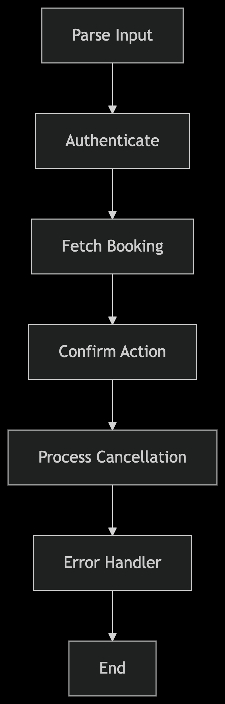

# Documentation

### Workflow Diagram

```
graph TD
    A[Parse Input] --> B[Authenticate]
    B --> C[Fetch Booking]
    C --> D[Confirm Action]
    D --> E[Process Cancellation]
    E --> F[Error Handler]
    F --> G[End]
```

### Diagram
